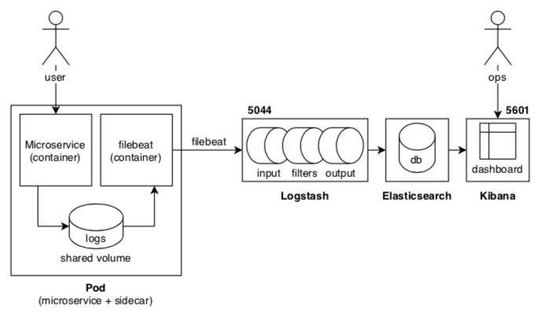
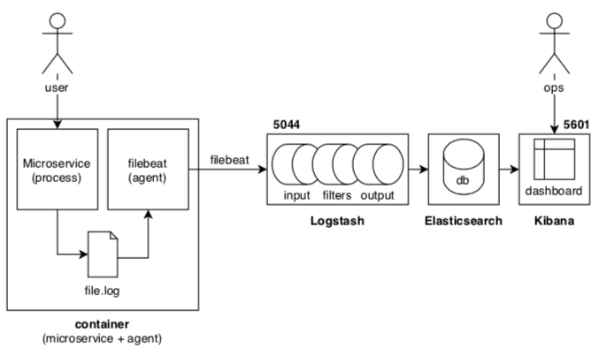
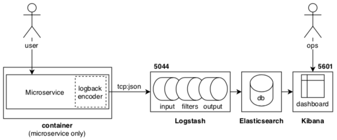

# Spring-boot + ELK

In questo tutorial verrà mostrato come poter inviare dei log di un microservizio Spring-boot a Logstash, per poter poi visualizzarli nella dashboard di Kibana.

## Possibili soluzioni

Logstash, anche se tipicamente usato per aggregare e processare log da inviare al database di Elasticsearch, permette in realtà di definire delle *pipeline* di manipolazione per varie tipologie di dati.

Uno degli strumenti più usati per inviare dati a Logstash è Beat, un servizio, o meglio, una famiglia si servizi (agenti) che vengono affiancati ad altri servizi per inviare i dati prodotti a Logstash. *Filebeat* è l'agente che viene usato per inviare dati testuali (come i log).

### Soluzione 1: Due container, unico POD (sidecar pattern)



Filebeat può essere eseguito all'interno di un container separato, distribuito assieme al container del microservizio (accanto, come un *sidecar*), facendo in modo che entrambi condividano un volume dove risiedono i log. I due container viaggeranno sempre assieme, e condivideranno sempre lo stesso host.

Kubernetes permette di facilitare questo pattern, inserendo entrambi i container all'interno di una stessa unità indivisibile, chiamata POD, assieme a risorse condivise come i volumi.

I log vengono vengono scritti dal microservizio in un file sul volume, e filebeat individua gli aggiornamenti in coda al file e li invia ad un endpoint di Logstash (`5044`) tramite un proprio protocollo (*beats*). Questo è un esempio di configurazione minimale per l'input di Logstash:

```text
input {
	beats {
		port => 5044
	}
}
```

### Soluzione 2: Singolo container con agente



Se non si ha il supporto ai pod, ed in presenza di più microservizi, fare in modo che ognuo di questi abbia associato il suo sidecar con filebeat potrebbe essere difficoltoso.

Un'alternativa è installare ed eseguire filebeat direttamente nel contaienr del microservizio. In questo caso i log dovranno sempre essere scritti in un file, ma la condivisione può essere ottenuta direttamente tramite il filesystem (layer) del container. Le modalità di invio dei log e la configurazione di Logstash rimangono inalterati rispetto al caso precedente. 

### Soluzione 3 (quella adottata): Invio log diretto dal microservizio (logback)



Per la gestione dei log, Spring-boot si affida alla libreria *logback*. Questa permette di configurare diversi aspetti legati al logging, ad esempio il livello di logging da adottare, se considerare o meno anche i log provenienti dalle librerie esterne, o dove inviare i log.

Invece di inviare i log solo su STDOUT o un file, altre modalità possono essere aggiunte tramite degli *appender* come il `logstash-logback-encoder`: questo permette di inviare i log in formato JSON a Logstash (sia in modalità TCP che UDP). Logstash dovrà quindi essere configurato per esporre un endpoint (su `5044`) a cui inviare log tu TCP in fomrato JSON:

```text
input {
	tcp {
		port => 5044
		codec => json_lines
	}
}
```

**Nel tutorial verrà usata questa soluzione**

## Endpoint usati nel tutorial

- Kibana: http://localhost:5601
- Hello (microservice): http://localhost:8080/hello

## Esecuzione

**Step 1:** Lanciare il container con tutto lo stack ELK:

```text
cd elk
chmod +x run.sh
./run.sh
```

La cartella `/etc/logstash/conf.d` verrà sostituita con la cartella `elk/conf.d` per la configurazione della pipeline di logstash.

Il container viene creato in `run.sh` usando il seguente comando:

```bash
docker run \
	-p 5601:5601 \
	-p 9200:9200 \
	-p 5044:5044 \
	-v "$(pwd)"/conf.d:/etc/logstash/conf.d:ro \
	-d --name elk sebp/elk
```

Il container espone 3 porte (bind su localhost):
- `5601` Kibana web interface
- `9200` Elasticsearch JSON interface
- `5044` Logstash: interfaccia TCP per riceve i log in formato json.

**Step 2:** Compilare ed eseguire il microservizio:
```text
mvn spring-boot:run
```

**Step 3:** Accedere all *hello* endpoint per generare dei log:
```text
curl localhost:8080/hello
```

**Step 4:** Accedere a Kibana per configurare l'accesso e la visualizzazione dei log: http://localhost:5601

## Riferimenti
- TL;DR: https://stackoverflow.com/questions/55634857/how-does-filebeats-get-invoked-when-using-logstash-in-this-java-spring-boot-app
- Introduzione a Logstash: https://www.elastic.co/blog/a-practical-introduction-to-logstash
- docker-elk (Docker Hub): https://hub.docker.com/r/sebp/elk
- docker-elk (Documentazione): https://elk-docker.readthedocs.io/
- Logstash Logback encoder: https://github.com/logstash/logstash-logback-encoder 
- Esempio spring-boot 1: https://github.com/rfding/spring-boot-elk-sample
- Esempio spring-boot 2: https://github.com/zhaoqingchris/springboot-elk-filebeat-example
- Esempio spring-boot 3 (avanzato):
https://github.com/xeraa/microservice-monitoring
- Esempi configurazione logback: https://mkyong.com/logging/logback-xml-example/
- Esempi configurazione logstash: https://www.elastic.co/guide/en/logstash/current/config-examples.html
- Tutorial: http://www.binaryheap.com/tech/programming/spring-boot-logback-and-logstash/
